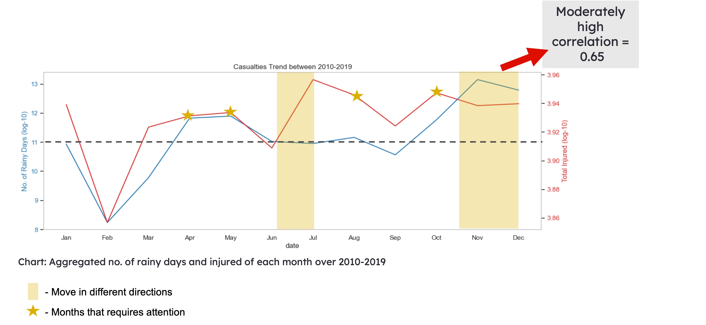

# Minimizing Road Accidents on Rainy Days

A research that investigates the impact of rainy days on road accidents and how to minimize it

### Introduction

On a global scale, Singapore ranked **fifth** in the estimated road traffic death rate per 100,000 vehicles (OECD, 2019). 

This ranking is alarming, considering Singapore's figure is much higher than that of geographically enormous countries like the USA, Canada and Australia. 

Within Singapore, **50% of overall road fatalities are motorcyclists and pillion riders**, and **50% of pedestrian fatalities are the elderly**. 

These statistics emphasize the urgent need for Singapore to address road safety comprehensively.

### Problem Statement

Rainy weather can impede our navigation skills on the road, either due to reduced visibility or more slippery surfaces. 

To what extent does weather play a part in road safety? How can we minimize road accidents stemmed from rainy weather?

### Purpose

As a leader in the climate research space, *DSI 39* spearheaded this research to explore the **relationship between rainy days and the number of road accident casualties**. Recommendations are proposed to the relevant goverment organizations based on the findings of the research. This research aims to discover:

* The effect of **rainy days** on the **number of road accident casualties** (correlation between number of rainy days vs casualties per month)
* Whether rainy weather **aggravates** road accidents (correlation between number of rainy days vs fatalities, number of rainy days vs injured per month)
* The **vehicle types** that are more prone to road accidents (rank number of casualties by vehicle types)

### Methodology

* The research analysis spanned a ten-year period from January 2010 to December 2019.
* Data sets were aggregated on a monthly basis over this ten-year period to mitigate the impact of irregular weather phenomena, such as the El Niño event in 2015-2016 and instances of intense rainfall/flooding in Jun 2010, Jan 2011, and Jan 2018.
* Data from 2020 onwards were excluded due to the effects of the COVID-19 pandemic.
* Data related to Personal Mobile Devices (PMD) were excluded since PMDs came into existence in Singapore only from 2017 onwards.

### Data Sources
To investigate the correlation between rainy days and road accidents, we utilized the following datasets (click on the hyperlinks to access):

#### <a href= "Data sources/raindays_by_mth.csv"> Number of Rainy Days per Month (Jan 2010 - Dec 2019) </a>

* We chose to use the number of rainy days rather than the specific amount of rainfall because it provides a better indication of how road accidents may be affected by the frequency of rain.

#### <a href= "Data sources/road_acc_by_mth.csv"> Number of Casualties: Fatalities and Injuries (Jan 2010 - Dec 2019) </a>

* The total number of casualties (the sum of fatalities and injuries) was used as a relative measure of road accidents.

* We also examined the total fatalities and total injuries to assess the severity of accidents.

* To identify which vehicle types are more susceptible to road accidents, we tabulated the total number of casualties across each vehicle type.

### Outlier

Before diving into a proper analysis, a scatter plot was created to get a quick glance at the relationship between the number of rainy days and the number of casualties.

Despite fairly dispersed data points, there is a **noticeable positive upward trend** between the two variables with a **correlation of 0.65**. 

An outlier, Feb 2014, was spotted - this is backed by the Metereological Service Singapore that reported "no rainfall from 16 January to 7 February 2014".

For a more accurate research, this outlier was removed in the following analyses.

### Section 1: The effect of rainy days on the number of road accident casualties

#### Number of Rainy Days vs Number of Casualties

##### Observations

* The correlation between the two variables **increased to 0.72** after removing the outlier, indicating a **strong correlation**.  

* Ignoring months where the two variables moved in different directions (covered by the yellow boxes), Jan, Mar - May, were the months with high rainfall and high number of casualties (marked by the yellow stars). 

### Section 2: Does rainy weather aggravates road accidents?

#### Observations

* The correlation between the number of rainy days and the number of fatalities is -0.03, which is extremely low.

* In contrast, the correlation between the number of rainy days and the number of injured is 0.65, which is moderately high.

* It appears that most casualties were injured in the months with comparatively high number of rainy days, while fatalities were likely related to other reasons. 

### Section 3: The vehicle types that are more prone to road accidents

#### Observations
In this bar graph, the top three vehicle types that had apparently higher number of casualties were:

 1. Motorcyclists and pillion riders
 2. Motor cars and station wagons
 3. Pedestrians
 
 
 ### Conclusion
 
 * Rainy days have a **significant impact** on the number of road accident casualties that result in **injuries but not fatalities**
 
 * Fatalities are likely affected by **other factors**, such as drink driving, failure to adhere to traffic rules, jaywalking etc (Motorist.sg, 2020).
 
 * **Jan, Mar and Apr** consistently had high number of casualties with relatively high number of rainy days. Rainy days in these months are likely due to the annual monsoon season (with Feb usually the exception being a drier month) (Meteorological Service Singapore, 2019). 
 
 * Though articles on Singapore road accident causes stated only human error reasons (Direct Asia, 2022; Motorist.sg, 2018), **the strong correlation suggests that rainy weather might have elevated those human error and resulted in road accident injuries**.  
 
 * During the **monsoon season**, the respective **government organizations** should practise more stringent road safety measures tailored to **motorcyclists and pillion riders, motor cars and station wagons and pedestrians**

### Recommendations
The table below proposes some targeted road safety measures:

### Limitations
1. Accuracy of research
	As this research uses an aggregated number of rainy days per month, there was no clear indication of which road accidents occurred on a rainy day. For a more accurate analysis, the total number of casualties on rainy days should be used.

2. Limited analysis on other factors
	With a focus on analysing the impact of wet weather on road accidents, this research does not take into account other factors that could be the primary reason of road accidents. A seperate research looking into the common human errors should be conducted in order to implement more comprehensive road safety measures.

3. Lack of geolocation data
	There is a lack of updated geolocation data that illustrates areas in Singapore that are more susceptible to road accidents. This is another variable worth investigating into to refine those road safety measures.

### References
- https://www.budgetdirect.com.sg/car-insurance/research/road-accident-statistics-in-singapore
- https://www.directasia.com/blog/reduce-risk-road-accidents-singapore
- https://www.motorist.sg/article/173/the-5-most-common-causes-for-road-accidents-in-singapore
- https://msgt.com.sg/accident-hotspots-in-singapore-to-watch-out-for/
- http://www.smj.org.sg/article/geospatial-analysis-severe-road-traffic-accidents-singapore-2013%E2%80%932014
- https://tablebuilder.singstat.gov.sg/
- https://www.weather.gov.sg/wp-content/uploads/2020/03/Annual-Climate-Assessment-Report-2019.pdf

